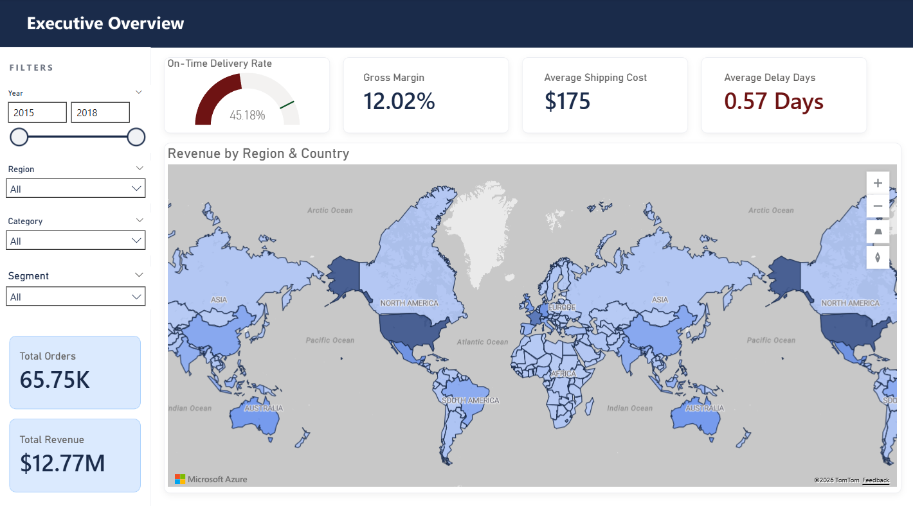
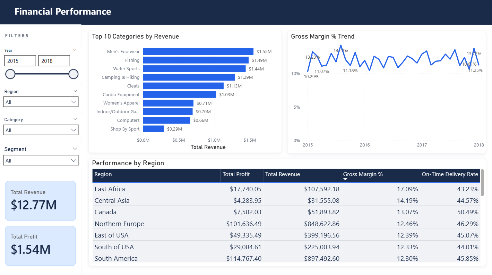
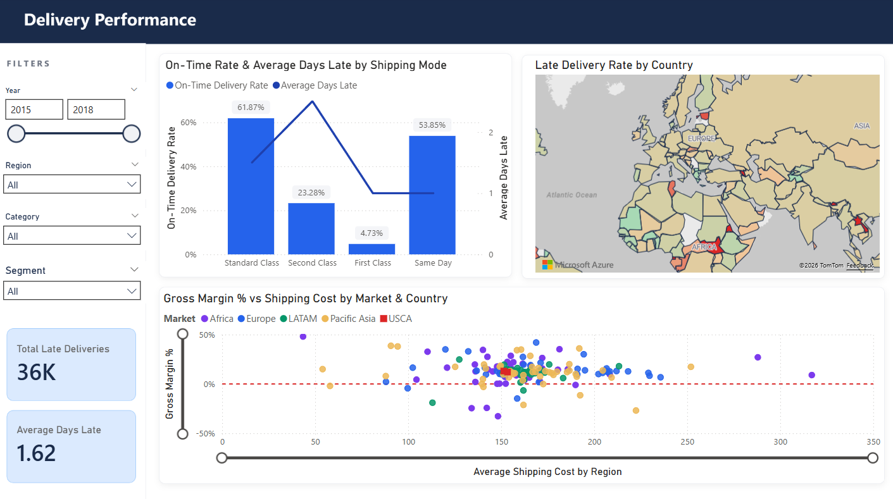

# 📦 BI Supply Chain Dashboard

> An end-to-end Business Intelligence project simulating an executive cockpit for supply chain operations — built with PostgreSQL, Python, and Power BI.

> **Screenshot - Executive Overview**



> **Screenshot - Financial Performance



> **Screenshot - Delivery Performance**


---

## 📌 Table of Contents

- Business Problem
- Dataset
- Architecture
- Tech Stack
- Dashboard
- KPIs & DAX Measures
- Key Technical Challenges
- Conclusions & Key Findings
- How to Run
- Project Structure
---

## 🎯 Business Problem

A logistics company is experiencing delivery delays, overstock in some product lines and stockouts in others. The Operations Director needs a **daily executive cockpit** that answers four critical questions at a glance:

- Are we delivering on time — and if not, where are we failing?
- Where are we losing money in logistics?
- Which products and regions are the most problematic?
- How is gross margin evolving over time?

This dashboard was designed to answer all four questions without requiring the Director to run a single query or open a spreadsheet.

---

## 🗂️ Dataset

|Field|Detail|
|---|---|
|**Name**|DataCo Smart Supply Chain for Big Data Analysis|
|**Source**|Kaggle|
|**Link**|[kaggle.com/datasets/shashwatwork/dataco-smart-supply-chain-for-big-data-analysis](https://www.kaggle.com/datasets/shashwatwork/dataco-smart-supply-chain-for-big-data-analysis)|
|**Volume**|180,519 records — 53 columns|
|**Format**|CSV|
|**Period**|2015–2018|

The dataset contains order, shipment, product, customer, and region data in a single flat file — making it a realistic starting point for Star Schema modelling, since real-world data rarely arrives pre-structured.

> **Note:** The dataset is not included in this repository due to file size. Download it from Kaggle and place it in the `/data` folder before running the ETL notebook.

---

## 🏗️ Architecture

The data was modelled into a **Star Schema** with 6 tables in PostgreSQL, separating facts from dimensions for optimal query performance and Power BI compatibility.

```
fact_orders
├── order_id (PK)
├── customer_id (FK → dim_customer)
├── product_id (FK → dim_product)
├── date_id   (FK → dim_date)
├── region_id (FK → dim_region)
├── quantity_ordered
├── unit_price
├── total_revenue
└── profit_margin

fact_shipments
├── shipment_id (PK)
├── order_id    (FK → fact_orders)
├── date_id     (FK → dim_date)
├── shipping_mode
├── days_for_shipping_real
├── days_for_shipment_scheduled
├── late_delivery_flag
└── shipping_cost
```

```
dim_product    →  product_id, product_name, category, department, unit_cost
dim_customer   →  customer_id, customer_segment, market, country
dim_date       →  date_id, full_date, year, quarter, month, month_name, week, is_weekend
dim_region     →  region_id, region, country, market
```


---

## 🛠️ Tech Stack

| Tool                                         | Purpose                                                    |
| -------------------------------------------- | ---------------------------------------------------------- |
| **PostgreSQL**                               | Relational database — Star Schema design and storage       |
| **Python** (pandas, psycopg2, python-dotenv) | ETL pipeline — data extraction, transformation and loading |
| **Jupyter Notebook**                         | Interactive ETL development and documentation              |
| **Power BI **                                | Data modelling, DAX measures, and dashboard visuals        |
| **GitHub**                                   | Version control and portfolio                              |

---

## 📊 Dashboard

The dashboard is structured across **three pages**, each serving a distinct analytical purpose.

### Page 1 — Executive Overview

Designed for the Operations Director's daily briefing. Answers: _"How are we performing right now?"_

| Visual     | Content                                            |
| ---------- | -------------------------------------------------- |
| Gauge      | On-Time Delivery Rate vs. 85% industry benchmark   |
| Card       | Gross Margin %                                     |
| Card       | Average Shipping Cost                              |
| Card       | Average Delay Days                                 |
| Card       | Total Orders                                       |
| Card       | Total Revenue                                      |
| Filled Map | Revenue by Geography — drill-down Region → Country |

### Page 2 — Financial Performance

Designed for financial analysis. Answers: _"Where are we making and losing money?"_

|Visual|Content|
|---|---|
|Card|Total Revenue|
|Card|Total Profit|
|Bar Chart|Top 10 Categories by Revenue|
|Line Chart|Gross Margin % Trend (drill-down Year → Quarter → Month)|
|Table|Performance by Region — Revenue, Profit, Gross Margin %, On-Time Rate|

### Page 3 — Delivery Performance

Designed for operational deep-dive. Answers: _"Where and why are deliveries failing?"_

| Visual         | Content                                                 |
| -------------- | ------------------------------------------------------- |
| Card           | Total Late Deliveries                                   |
| Card           | Average Days Late                                       |
| Combined Chart | On-Time Rate & Avg Days Late by Shipping Mode           |
| Filled Map     | Late Delivery Rate by Country (green = low, red = high) |
| Scatter        | Gross Margin % vs Avg Shipping Cost by Market & Country |

Slicers are **synchronised across all three pages** — Year range, Region, Category, Customer Segment.

---

## 📐 KPIs & DAX Measures

All measures are stored in a dedicated `_Measures` table for organisation. Measures that cross fact tables use `TREATAS()` to propagate filter context — see [Key Technical Challenges](https://claude.ai/chat/8a064e25-f4c1-4c4b-ba8c-ebc53ce33216#-key-technical-challenges) for details.

```dax
Total Revenue =
SUM(fact_orders[total_revenue])

Total Orders =
COUNTROWS(fact_orders)

Total Profit =
SUMX(fact_orders, fact_orders[total_revenue] * fact_orders[profit_margin])

Gross Margin % =
AVERAGE(fact_orders[profit_margin])

Avg Shipping Cost =
DIVIDE(SUM(fact_shipments[shipping_cost]), COUNTROWS(fact_orders))

On-Time Delivery Rate =
VAR FilteredOrders = VALUES(fact_orders[order_id])
RETURN
DIVIDE(
    CALCULATE(
        COUNTROWS(fact_shipments),
        fact_shipments[late_delivery_flag] = FALSE(),
        TREATAS(FilteredOrders, fact_shipments[order_id])
    ),
    CALCULATE(
        COUNTROWS(fact_shipments),
        TREATAS(FilteredOrders, fact_shipments[order_id])
    )
)

Total Late Deliveries =
VAR FilteredOrders = VALUES(fact_orders[order_id])
RETURN
CALCULATE(
    COUNTROWS(fact_shipments),
    fact_shipments[late_delivery_flag] = TRUE(),
    TREATAS(FilteredOrders, fact_shipments[order_id])
)

Avg Days Late =
VAR FilteredOrders = VALUES(fact_orders[order_id])
RETURN
CALCULATE(
    AVERAGEX(
        FILTER(fact_shipments, fact_shipments[late_delivery_flag] = TRUE()),
        fact_shipments[days_for_shipping_real] - fact_shipments[days_for_shipment_scheduled]
    ),
    TREATAS(FilteredOrders, fact_shipments[order_id])
)

Late Delivery Rate =
VAR FilteredOrders = VALUES(fact_orders[order_id])
RETURN
DIVIDE(
    CALCULATE(
        COUNTROWS(fact_shipments),
        fact_shipments[late_delivery_flag] = TRUE(),
        TREATAS(FilteredOrders, fact_shipments[order_id])
    ),
    CALCULATE(
        COUNTROWS(fact_shipments),
        TREATAS(FilteredOrders, fact_shipments[order_id])
    )
)

Avg Shipping Cost by Region =
VAR FilteredOrders = VALUES(fact_orders[order_id])
RETURN
CALCULATE(
    AVERAGEX(fact_shipments, fact_shipments[shipping_cost]),
    TREATAS(FilteredOrders, fact_shipments[order_id])
)
```

---

## 🔧 Key Technical Challenges

Several non-trivial problems were encountered and solved during this project.

### 1. Timestamp duplicates in dim_date

The raw `order date` column contained full timestamps (e.g. `2018-01-13 12:27:00`), causing `drop_duplicates()` to treat each unique minute as a distinct date — producing ~65,000 rows instead of ~1,127 unique dates. Fixed by converting with `pd.to_datetime()` and stripping the time component with `.dt.date` before deduplication.

### 2. PostgreSQL connection state errors

After a failed SQL transaction, psycopg2 enters an `InFailedSqlTransaction` state and blocks all subsequent commands. Fixed with `conn.rollback()` to reset the connection before retrying.

### 3. Composite key for dim_region

Region names are not globally unique — "Eastern Asia" maps to both China and Japan. A single `region` column as the join key produced an `InvalidIndexError` during the pandas lookup. Fixed by building a composite `(region, country)` index.

### 4. Boolean type mismatch on insertion

The `late_delivery_flag` column in the CSV is stored as integer (0/1). PostgreSQL's BOOLEAN type rejected integer values on insert. Fixed with `.astype(bool)` before loading.

### 5. Cross-filtering between two fact tables

The model has two fact tables — `fact_orders` and `fact_shipments` — connected through `dim_date` and a 1:1 `order_id` relationship. Slicers on `dim_region`, `dim_product`, and `dim_customer` filtered `fact_orders` correctly but did not propagate to `fact_shipments`, leaving all shipment-level KPIs unresponsive.

Solved using `TREATAS()` in DAX — applied consistently across all shipment measures:

```dax
VAR FilteredOrders = VALUES(fact_orders[order_id])
RETURN CALCULATE(
    ...,
    TREATAS(FilteredOrders, fact_shipments[order_id])
)
```

This propagates the filtered `order_id` context from `fact_orders` into `fact_shipments`, making all slicers work correctly across both fact tables.

---

## 📌 Conclusions & Key Findings

This analysis covers **65,752 orders** across **180,519 records** from 2015 to 2018, generating **$12.77M in total revenue** and **$1.54M in total profit** across global markets.

### 1. Geographic Revenue Concentration

The United States is by far the highest revenue-generating country, producing nearly double that of Mexico ($1.40B vs ~$751M), representing a significant concentration risk. At market level, **LATAM leads with $2.9B**, followed by **Europe at $2.66B**. Africa is the only market below $1B at $638M — and combined with the highest late delivery rates in the scatter analysis, suggests that both commercial penetration and operational reliability remain underdeveloped in that region.

### 2. On-Time Delivery Crisis

The overall **On-Time Delivery Rate of 45.18%** is critically below the **85% industry benchmark** — meaning more than half of all orders arrive late. This is not an isolated problem: **36,050 late deliveries** span all regions, segments, and shipping modes, indicating a systemic operational failure.

The breakdown by shipping mode reveals the most alarming finding in the dataset:

|Shipping Mode|On-Time Rate|
|---|---|
|Standard Class|61.87%|
|Same Day|53.85%|
|Second Class|23.28%|
|**First Class**|**4.73%**|

**First Class — the most premium shipping option — has only a 4.73% on-time rate**, with Second Class averaging 2.5 days late when delayed. Customers paying for priority delivery are receiving the worst service in the portfolio. This warrants immediate carrier-level investigation.

Late delivery rates are virtually identical across all customer segments — Home Office (55.23%), Corporate (54.75%), Consumer (54.73%) — confirming the problem is structural and not driven by order type.

### 3. Gross Margin Stability with a 2018 Anomaly

Gross margin remained stable between **10% and 15%** throughout 2015–2017. However, 2018 shows a decline to **9.23%** alongside a dramatic revenue drop to $331K vs $5.07M in 2017. This almost certainly reflects **incomplete 2018 data** rather than a genuine collapse — but if complete, would represent an existential crisis requiring immediate investigation.

### 4. Revenue Concentration by Category

The top three categories — **Men's Footwear ($1.55M), Fishing ($1.49M), Water Sports ($1.44M)** — are tightly clustered. However, there is a significant revenue cliff between 9th and 10th place (Computers at $0.28M vs the cluster above $0.66M), suggesting the bottom categories have limited commercial relevance and may warrant a strategic catalogue review.

### 5. Profitability vs Volume Paradox

**Central America** generates the highest absolute profit ($197K on $1.61M revenue), followed by **Western Europe** ($172K on $1.42M). However, the most interesting finding lies in smaller markets: **East Africa has the highest gross margin at 17.09%** but only $18K in total profit due to low volume. **Central Asia** shows 14.19% margin on just $4,230 in profit.

This reveals a classic profitability paradox — the markets with the best unit economics are too small to scale. A targeted volume expansion strategy in East Africa and Central Asia, contingent on first improving delivery reliability, could yield disproportionate profit gains.

### 6. Shipping Cost and Negative Margin Countries

The scatter analysis reveals that most countries operate with positive margins, but a cluster concentrated in **Africa and Pacific Asia** shows negative gross margins. These countries typically have very low order volumes (1–15 orders), making the averages statistically fragile — a single loss-making order can produce a dramatically negative result. **Swaziland** stands out as the highest average shipping cost country at **$316 per order** while maintaining a positive 9% gross margin, demonstrating that high logistics costs alone do not determine profitability.

### 7. Most Delayed Products

|Product|Late Deliveries|
|---|---|
|Nike Men's CJ Elite 2 TD Football Cleat|6,809|
|Perfect Fitness Perfect Rip Deck|3,934|
|Pelican Sunstream 100 Kayak|3,807|
|Nike Men's Dri-FIT Victory Golf Polo|2,800|
|Diamondback Women's Serene Classic Comfort Bi|2,450|

The Nike Men's CJ Elite has nearly **double** the late deliveries of the second-worst product. Given its position as a high-revenue item, the business impact of its delivery failures is compounded — making it the first priority for supply chain investigation.

### Summary of Priority Actions

1. **Investigate First Class shipping carriers immediately** — 4.73% on-time rate on the premium tier is commercially unacceptable
2. **Focus delivery improvement on the Nike Men's CJ Elite** — highest volume, highest late delivery count
3. **Validate 2018 data completeness** — the revenue drop is anomalous and requires confirmation
4. **Explore volume expansion in East Africa and Central Asia** — best margin profiles in the portfolio, currently underserved
5. **Audit loss-making countries in Africa and Pacific Asia** — low volume makes data fragile, but the pattern warrants monitoring

---

## 🚀 How to Run

### Prerequisites

- Python 3.8+
- PostgreSQL 13+
- Power BI Desktop

### Setup

1. Clone this repository:

```bash
git clone https://github.com/your-username/bi-supply-chain.git
cd bi-supply-chain
```

2. Install Python dependencies:

```bash
pip install -r requirements.txt
```

3. Download the dataset from [Kaggle](https://www.kaggle.com/datasets/shashwatwork/dataco-smart-supply-chain-for-big-data-analysis) and place it in `/data`
    
4. Create a PostgreSQL database named `supply_chain`
    
5. Create a `.env` file in the root folder:
    

```
DB_HOST=localhost
DB_PORT=5432
DB_NAME=supply_chain
DB_USER=postgres
DB_PASSWORD=your_password
DATA_PATH=data/DataCoSupplyChainDataset.csv
```

6. Run the SQL script to create the schema:

```bash
psql -U postgres -d supply_chain -f sql/01_create_tables.sql
```

7. Run the ETL notebook top to bottom:

```
notebooks/01_etl_pipeline.ipynb
```

8. Open `powerbi/supply_chain.pbix` in Power BI Desktop

---

## 📁 Project Structure

```
bi-supply-chain/
│
├── data/                              ← not tracked by Git (file too large)
│   └── DataCoSupplyChainDataset.csv
│
├── notebooks/
│   └── 01_etl_pipeline.ipynb         ← Python ETL: extract, transform, load
│
├── sql/
│   ├── 01_create_tables.sql          ← Star Schema DDL
│   └── 02_questions.sql              ← Analytical queries used for conclusions
│
├── powerbi/
│   ├── supply_chain.pbix             ← Power BI report file
│   └── dashboard_background.pptx    ← Custom slide backgrounds
│
├── docs/
│   ├── erd.png                       ← Entity-Relationship Diagram
│   └── dashboard_preview.png         ← Dashboard screenshot
│
├── .gitignore
├── requirements.txt
└── README.md
```

---

_Built in June 2026 — Portfolio project by João Ferlicíssimo
_Dataset: DataCo Smart Supply Chain for Big Data Analysis (Kaggle)_
